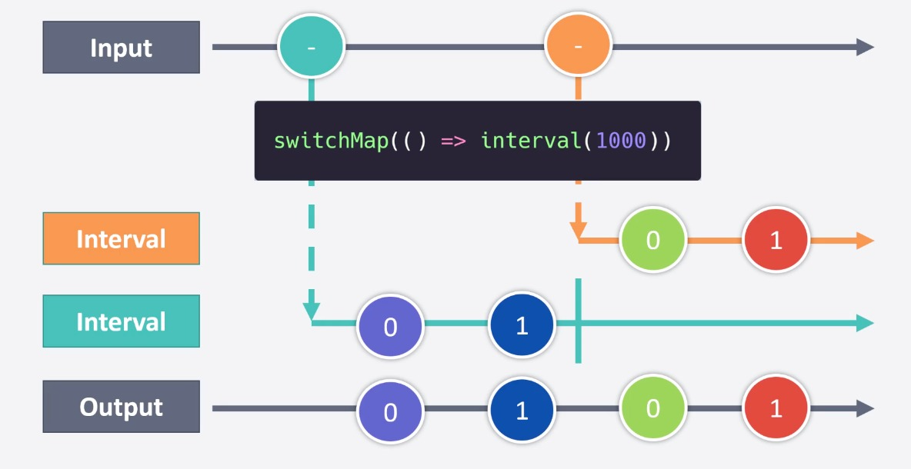

# RxJS Fundamental Concepts:

## Observables and Observers

- Observable is a wrapper around a data source, it can sort, filter, and coordinate data.

- Observer is an object to observe the Observables, it is responsible of receiving data after an Observable has emitted the data.

## Subscriptions

- Subscription is a connection established by an Observer with an Observable. Multiple Observers can subscribe to an Observable.

## Declarative programming with Operators

- Imperative programming focuses on the HOW whereas declarative programming focuses on the WHAT.

- Underneath declarative programming is an imperative abstraction

- Operators are Functions that help us to avoid imperative programming.

- Two types of operators:

### Creation Operators: Create new observables.

Operators List: https://rxjs.dev/api

- Interval with 1 second interval:
  `const observable = interval(1000)`

- Timer with 5 seconds delay and 2 second interval:
  `const observable = timer(5000, 2000)`

- fromEvent: Creates an Observable that emits events of a specific type/eventName coming from the given event target.

```ts
import { fromEvent } from "rxjs";

const clicks = fromEvent(document, "click");
clicks.subscribe((x) => console.log(x));

// Results in:
// MouseEvent object logged to console every time a click
// occurs on the document.
```

- from: converts almost anything to an Observable, also converts a Promise, an array-like or an iterable object into an Observable that emits the items in that promise, array, or iterable. A String is treated as an array of characters.

```ts
import { from } from "rxjs";

const array = [10, 20, 30];
const result = from(array);

result.subscribe((x) => console.log(x));

// Logs:
// 10
// 20
// 30
```

- of: converts the arguments to an observable sequence, emitting each argument in whole as a separate next notification. Unlike from, it does not do any flattening and emits each argument in whole as a separate next notification.

```ts
import { of } from "rxjs";

of(10, 20, 30).subscribe({
  next: (value) => console.log("next:", value),
  error: (err) => console.log("error:", err),
  complete: () => console.log("the end"),
});

// Outputs
// next: 10
// next: 20
// next: 30
// the end
```

### Pipeable Operators:

They are functions for transforming, filtering, and combining data. Taking an observable as an input and output a new observable.

```ts
const observable = new Observable();

const operatorFunc = firstOperator(config);

const newObservable = operatorFunc(observable);

const operatorFuncTwo = secondOperator(config);

const newObservableTwo = operatorFuncTwo(newObservable);
```

```ts
const observable = new Observable();
observable.pipe(firstOperator(config), secondOperator(config)).subscribe();
```

- The Map Operator: similar to Array.map() but applier a given project function to each value emitted by the source Observable, and emits the resulting values as an Observable.

```ts
import { of } from "rxjs";
import { map } from "rxjs/operators";

const observable = of(1, 2, 3, 4, 5).pipe(map((value) => `$${value}`));
```

### Marble Diagram

A marble diagram is a graphical representation used in the context of reactive programming and specifically in the documentation of the RxJS library. The diagram is used to visualize how events and data flow through an RxJS observable stream over time.

Each circle in the diagram represents an event or a value being emitted by the observable, and the arrows show the flow of the events over time. Operators are represented as boxes that transform the incoming events or data into new events or data that are emitted to the next stage of the observable pipeline.

Marble diagrams provide a concise and visual way to understand the behavior of observables, the operations performed on them, and the resulting output. This can be very useful for developers who are learning about the reactive programming concepts and RxJS library, as well as for communicating the behavior of observables to others.

\*Example of a Marble Diagram for the map function operator https://rxjs.dev/api/index/function/map

### Pluck Operator (Deprecated)

Use map and optional chaining: `pluck('foo', 'bar')` is `map(x => x?.foo?.bar)`. Will be removed in v8.

### Filter Operator

Filter items emitted by the source Observable by only emitting those that satisfy a specified predicate.

Like Array.prototype.filter(), it only emits a value from the source if it passes a criterion function.

```ts
import { fromEvent, filter } from "rxjs";

const div = document.createElement("div");
div.style.cssText = "width: 200px; height: 200px; background: #09c;";
document.body.appendChild(div);

const clicks = fromEvent(document, "click");
const clicksOnDivs = clicks.pipe(
  filter((ev) => (<HTMLElement>ev.target).tagName === "DIV")
);
clicksOnDivs.subscribe((x) => console.log(x));

// Emit only click events whose target was a DIV element
```

### Reduce Operator

Applies an accumulator function over the source Observable, and returns the accumulated result when the source completes, given an optional seed value.

Combines together all values emitted on the source, using an accumulator function that knows how to join a new source value into the accumulation from the past.

Like Array.prototype.reduce(), reduce applies an accumulator function against an accumulation and each value of the source Observable (from the past) to reduce it to a single value, emitted on the output Observable. Note that reduce will only emit one value, only when the source Observable completes.

```ts
import { of } from "rxjs";

import { reduce } from "rxjs/operators";

const observable = of(1, 2, 3, 4, 5).pipe(reduce((acc, val) => (acc = val), 0));
const subscription = observable.subscribe((x) => console.log(x));
// returns:
// 15
```

### Take Operator

Emits only the first count values emitted by the source Observable.

take returns an Observable that emits only the first count values emitted by the source Observable. If the source emits fewer than count values then all of its values are emitted. After that, it completes, regardless if the source completes.

```ts
const observable = interval(500).pipe(
  take(5),
  reduce((acc, val) => acc + val, 0)
);
const subscription = observable.subscribe((x) => console.log(x));
// returns:
// 10
```

### Scan Operator

It's like reduce, but emits the current accumulation state after each update

```ts
const observable = interval(500).pipe(
  take(5),
  scan((acc, val) => acc + val, 0)
);
const subscription = observable.subscribe((x) => console.log(x));
// returns:
// 0
// 1
// 3
// 6
// 10
```

### Tap Operator

Used to perform side-effects for notifications from the source observable

The most common use of tap is actually for debugging. You can place a tap(console.log) anywhere in your observable pipe, log out the notifications as they are emitted by the source returned by the previous operation.

```ts
const observable = interval(500).pipe(
  take(5),
  tap({
    next(value) {
      console.log(val)
    }
  }),
  reduce((acc, val) => acc + val, 0)
);
const subscription = observable.subscribe((x) => console.log(x));
// returns:
// 0 -tap
// 1 -tap
// 2 -tap
// 3 -tap
// 4 -tap
// 10
```
### Need of Flattening Operators

Example of why we need flattening operators when returning an observable.

```ts
const button = document.querySelector("#btn");

const observable = fromEvent(button, "click").pipe(
  map(() => {
    return ajax.getJSON("https://jsonplaceholder.typicode.com/todos/1");
  })
);

const subscription = observable.subscribe({
  next(value) {
    value.subscribe(console.log);
  },
  complete() {
    console.log("Completed");
  },
});
// returns:
// Observable {source: Observable, operator: MapOperator}
```
It's returning an observable, to access to the ajax.getJSON() object we need to subscribe to this inner observable. To avoid that we can use Flattening Operators like the following MergeMap Operator.

### MergeMap Operator

Projects each source value to an Observable which is merged in the output Observable.

Maps each value to an Observable, then flattens all of these inner Observables using mergeAll.


```ts
const button = document.querySelector("#btn");

const observable = fromEvent(button, "click").pipe(
  mergeMap(() => {
    return ajax.getJSON("https://jsonplaceholder.typicode.com/todos/1");
  })
);

const subscription = observable.subscribe({
  next(value) {
    console.log(value);
  },
  complete() {
    console.log("Completed");
  },
});
// returns:
// {userId: 1, id: 1, title: "delectus aut autem", completed: false}
```

### SwitchMap Operator

Projects each source value to an Observable which is merged in the output Observable, emitting values only from the most recently projected Observable.



SwitchMap is considered one of the most safest flattening operators.

### ConcatMap Operator

Returns an Observable that emits items based on applying a function that you supply to each item emitted by the source Observable, where that function returns an (so-called "inner") Observable. Each new inner Observable is concatenated with the previous inner Observable.


Code example, trigger 5 clicks with slow 3G throttling:

```ts
const button = document.querySelector("#btn");

const observable = fromEvent(button, "click").pipe(
  concatMap(() => {
    return ajax.getJSON("https://jsonplaceholder.typicode.com/todos/1").pipe(
      take(5),
      tap({
        complete() {
          console.log("Inner observable completed");
        },
      })
    );
  })
);
// returns 5 times:
// {userId: 1, id: 1, title: "delectus aut autem", completed: false}
// Inner observable completed
```


Warning: if source values arrive endlessly and faster than their corresponding inner Observables can complete, it will result in memory issues as inner Observables amass in an unbounded buffer waiting for their turn to be subscribed to.

### ExhaustMap Operator

ExhaustMap projects each source value to an Observable which is merged in the output Observable only if the previous projected Observable has completed.


Returns an Observable containing projected Observables of each item of the source, ignoring projected Observables that start before their preceding Observable has completed.


### Flattening Operators Recap

FO are Operators for subscribing to inner Operators

- switchMap: Stop working on the order and start working on the new order. Only the latest order will be finished.

- concatMap: The order gets added to a queue. You finish whatever order you're working on. Once you finish the order, you will work on the next order.

- mergeMap: You will work on all orders at the same time as soon as you're given them.

- exhaustMap: You ignore new orders and finish whatever order you're working on. One finished, you are free to accept new orders.